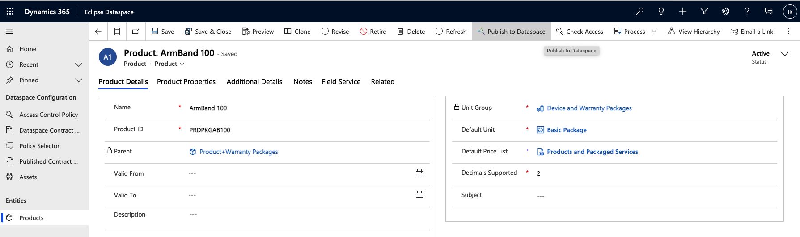
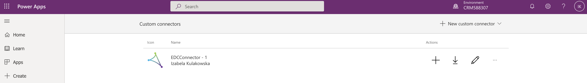
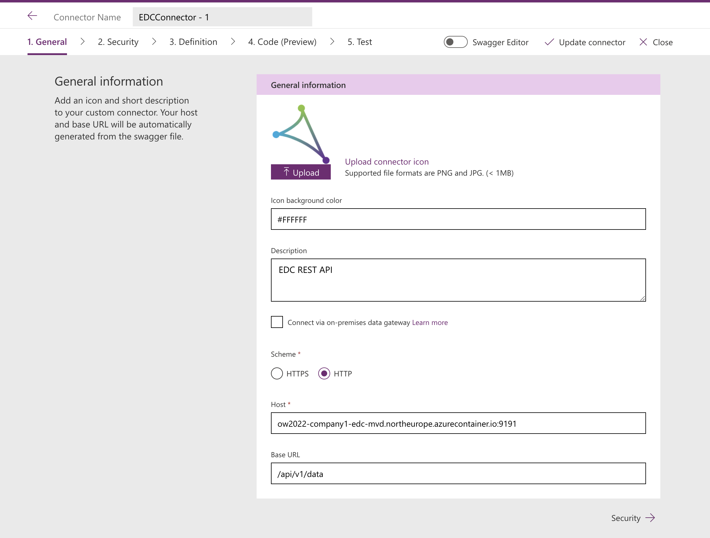
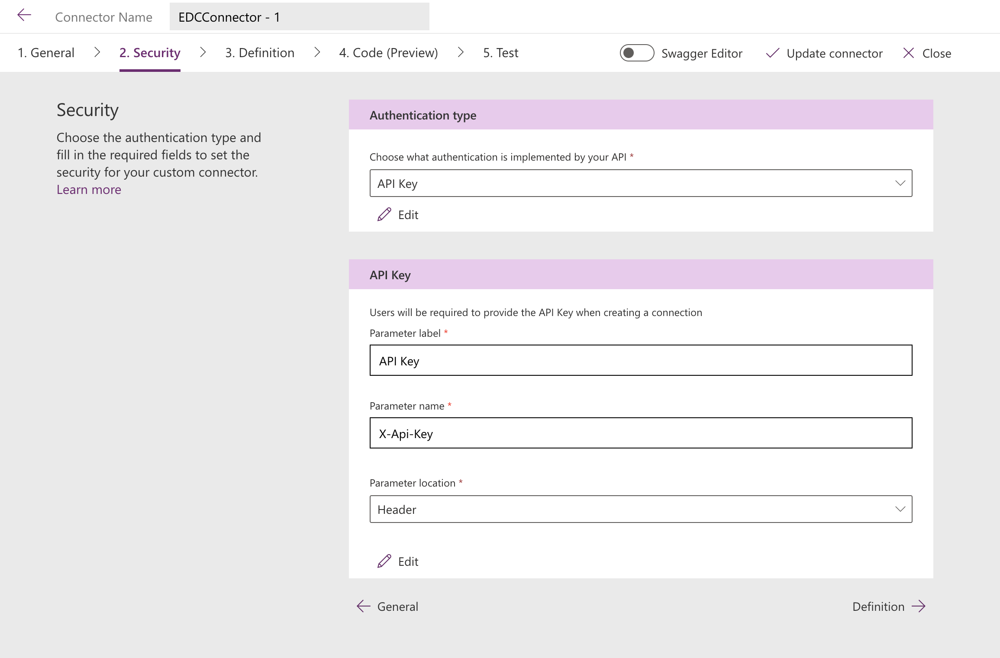
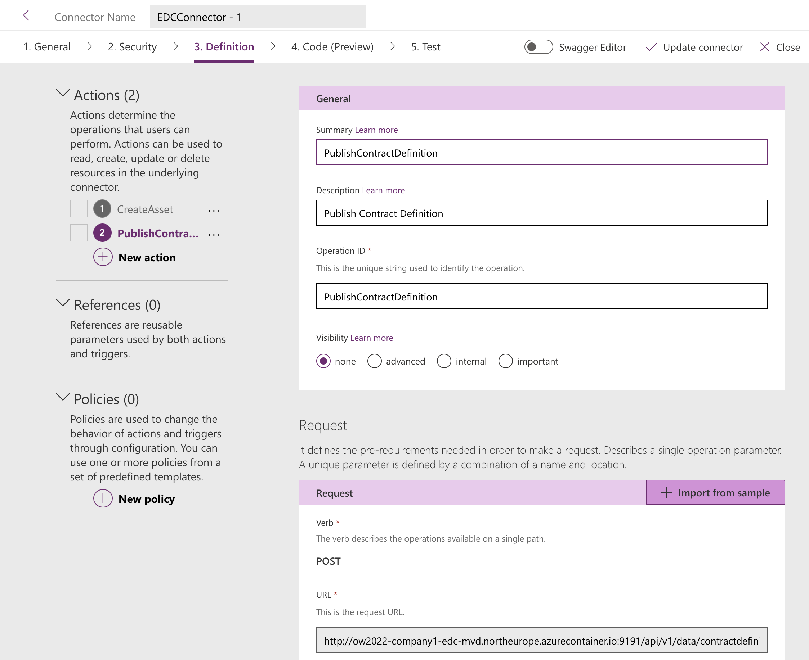
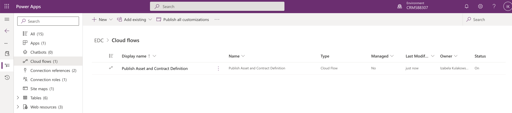
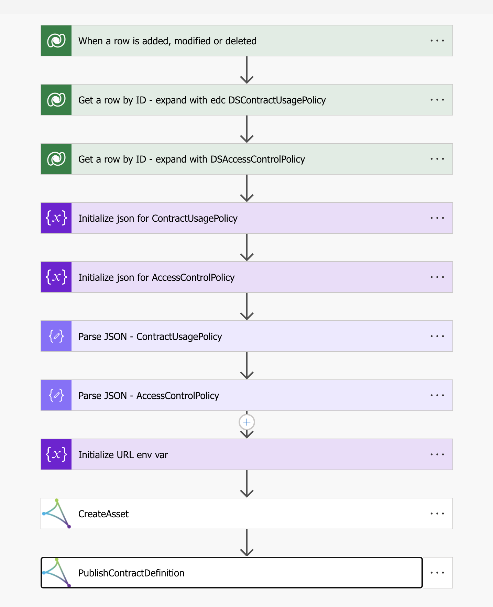

# Integration with Dataverse

This doc presents the output of the hack project aiming to integrate the Dataverse with the Dataspaces. 
The Dataverse was used as a data source orchestrated with a feature to publish assets and contract definitions to the EDC.

The [EDC_1_0_0_2 folder](EDC_1_0_0_2) contains below described solution exported from the Dataverse.

## Publishing assets and contract definitions

To test the solution we used a sample data table Products. Each product corresponds to one asset in EDC. To publish an asset for a record in Products table 
we created a custom ribbon button "Publish to dataspaces" which is shown on the top of the Product view in newly created [Eclipse Dataspace app](#power-app).
Clicking this button triggers creating a new record of DSPublish table which corresponds to a contract definition in EDC. Creating a new record in the 
DSPublish table triggers a Power Automate flow that publishes an asset and corresponding contract definitions to the EDC calling EDC REST API.

### Power App

To manage the data we created a new Power App called Eclipse Dataspace containing 2 sections

Entities:
- table Products - the company bussiness data

Dataspace Configuration
- Access Control Policy
- Dataspace Contract Usage Policies
- Policy Selector - a composite entity combining Access control Policy and Contract Usage Policy
- Published Contract Definitions
- Assets - unused



### "Publish to dataspace" button


"Publish to dataspace" button was created using JScript Web Resource button with the following JScript code:

```javascript

function publishToDataspace(currentControl) {
    // v2.0
    console.log("publishToDataspace");
    
    var parameters = {};
    parameters["edc_publishedrecordid"] = currentControl.data.entity.getId();  
    parameters["edc_publishedtablename"] = currentControl.data.entity.getEntityName();

    var entityFormOptions = {};
    entityFormOptions["entityName"] = "edc_dspublish";

    Xrm.Navigation.openForm(entityFormOptions, parameters).then(
        function (success) {
            console.log(success);
        },
        function (error) {
            console.log(error);
        }
    );  
}

```

### Custom connector in Power Automate

We created a custom connector in Power Automate with 2 actions calling EDC API: createAsset and publishContractDefinition. 






### Power Automate flow

Automated flow was created to trigger a flow on the newly added DSPublish record.



Steps in the flow:



### Current status

During our hack we used some simplification for the solution to be able to quickly evaluate if the solution works.

Simplifications:
- Hardcoded EDC host URL in the Power Automate connector. In current solution if we want to publish the data to different EDC instance we need to change the 
  EDC host url in multiple places in the custom connector. Solution for that would be a [parametrization the connection for EDC host url](https://docs.
  microsoft.com/en-us/connectors/custom-connectors/environment-variables).

### Future considerations

- Decoupled Asset Relationships in Dataverse - more information in the [decision record doc](../docs/developer/decision-records/2022-05-19-asset-relationships/README.md)

 